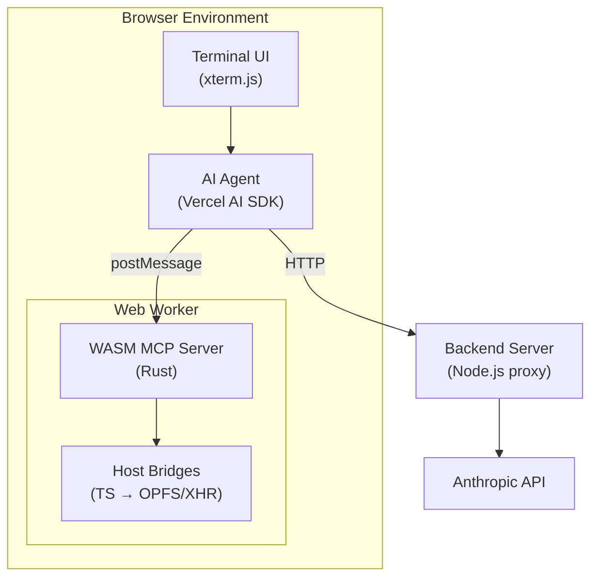

# Agent in a Browser

A fully browser-native AI coding assistant. No server required for execution—just your API key and a browser.

## What This Is & Why It Exists

**Agent in a Browser** is an autonomous AI agent that runs entirely in your browser. It provides a terminal-based interface where you can converse with AI models (Anthropic Claude, OpenAI GPT, or any OpenAI-compatible endpoint) and give them real tools to work with: a file system, shell commands, TypeScript execution, HTTP requests, and more.

### The Problem

Most AI coding assistants require either:

- **Cloud-hosted sandboxes** (privacy concerns, latency, cost)
- **Local installation** (friction, system dependencies, platform limitations)
- **Proprietary runtimes** (vendor lock-in, closed-source execution environments)

### The Solution

Web Agent takes a different approach:

| Requirement | How Web Agent Solves It |
|-------------|------------------------|
| **Zero installation** | Opens in any modern browser |
| **Full privacy** | API keys stay in your browser (memory-only, never persisted) |
| **Real tools** | WASM sandbox with shell, file system, TypeScript, HTTP |
| **Bring your own key** | Direct API calls to Anthropic/OpenAI—no proxy required |
| **100% open source** | No proprietary sandboxes or execution environments |
| **Works offline** | Once loaded, the sandbox runs without network (except LLM calls) |

### What You Can Do

- Ask the AI to write code, and it can actually **run** it in the sandbox
- Persist files across sessions using the browser's [Origin Private File System (OPFS)](https://developer.mozilla.org/en-US/docs/Web/API/File_System_API/Origin_private_file_system)
- Use 30+ Unix-like shell commands: `ls`, `cat`, `grep`, `sed`, `find`, `curl`, `jq`, `diff`, `sort`, `wc`, and more
- Execute TypeScript/JavaScript with ESM imports (auto-resolved from [esm.sh](https://esm.sh) CDN)
- Make HTTP requests from within scripts (`fetch()` available)
- Switch between AI providers and models on the fly (`/provider`, `/model`)
- Connect to remote MCP servers with OAuth 2.1 PKCE authentication (`/mcp add`, `/mcp auth`)
- Queue messages while the agent is working, with real-time "steering" support

### Terminal Interface Features

| Feature | Description |
|---------|-------------|
| **Split-panel TUI** | Main terminal + auxiliary panel for tasks, files, and output |
| **Multi-provider support** | Anthropic, OpenAI, and any OpenAI-compatible endpoint |
| **Bring your own API key** | Keys stored in browser memory only (never persisted) |
| **Persistent history** | Last 1000 commands saved across sessions (localStorage) |
| **Reverse-i-search** | Press `Ctrl+R` to search command history |
| **Real-time steering** | Send messages while the agent is working to adjust its approach |
| **Remote MCP servers** | Connect to external MCP servers with full OAuth 2.1 support |

### Key Design Principles

1. **Browser-First**: All execution happens in a WASM sandbox running in a Web Worker. No server-side code execution.
2. **OSS-Only Stack**: Rust + WASI P2 for the sandbox, QuickJS for JS execution, SWC for TypeScript transpilation.
3. **MCP Native**: Tools are exposed via [Model Context Protocol](https://spec.modelcontextprotocol.io/), making the architecture extensible and standardized.
4. **Security by Isolation**: The sandbox cannot access your real file system or make unauthorized network requests.
5. **Multi-Provider**: Designed for "bring your own key"—works with Anthropic, OpenAI, or any OpenAI-compatible API.

### Why WASI Preview 2?

We chose [WASI Preview 2](https://github.com/WebAssembly/WASI/blob/main/preview2/README.md) (the Component Model) over WASI Preview 1 or raw WASM for several reasons:

| Aspect | WASI P1 | WASI P2 (Component Model) |
|--------|---------|---------------------------|
| **Interface Design** | POSIX-like, monolithic | Modular, composable interfaces |
| **HTTP Support** | Not standardized | `wasi:http` with typed requests/responses |
| **Async I/O** | `poll_oneoff` (limited) | First-class `Pollable` resources |
| **Type Safety** | C-style ABI | WIT-defined strongly-typed interfaces |
| **Future-Proofing** | Legacy, frozen | Active development, ecosystem growth |

**Specific benefits for this project:**

- **`wasi:http/incoming-handler`**: The WASM component exports an HTTP handler, making it trivially callable via POST requests from JavaScript. No custom FFI needed.
- **`wasi:filesystem`**: Standard file operations that we bridge to OPFS via TypeScript shims. The interface is well-defined and testable.
- **Component composition**: We can potentially add more WASM components (e.g., image processing, crypto) without changing the host integration.
- **`jco transpile`**: The [jco](https://github.com/bytecodealliance/jco) toolchain transpiles WASI P2 components to ES modules with automatic host bindings.

The tradeoff is complexity: WASI P2 requires custom JavaScript shims for browser APIs (OPFS, sync XHR) since there's no native browser WASI runtime yet. We implemented these in `frontend/src/wasm/`.

---

## Slash Commands

These commands are available in the terminal:

| Command | Description |
|---------|-------------|
| `/help` | Show available commands |
| `/clear` | Clear conversation history |
| `/files [path]` | List files in sandbox |
| `/provider` | View/switch AI provider (interactive selector) |
| `/model` | View/switch AI model (interactive selector) |
| `/keys` | Manage API keys |
| `/panel [show\|hide]` | Toggle auxiliary panel |

### Remote MCP Servers

Connect to external MCP-compatible servers:

| Command | Description |
|---------|-------------|
| `/mcp` | Show MCP status |
| `/mcp list` | List registered servers with IDs |
| `/mcp add <url>` | Add a remote MCP server |
| `/mcp remove <id>` | Remove a registered server |
| `/mcp auth <id>` | Authenticate with OAuth 2.1 PKCE |
| `/mcp connect <id>` | Connect to a server |
| `/mcp disconnect <id>` | Disconnect from a server |

---

## Architecture



**Components:**

| Component | Technology | Purpose |
|-----------|------------|---------|
| [runtime/](runtime/README.md) | Rust + WASI P2 | WASM MCP server with TypeScript execution |
| [frontend/](frontend/src/README.md) | TypeScript + Vite | Terminal UI with AI agent orchestration |
| [frontend/src/wasm/](frontend/src/wasm/README.md) | TypeScript | Host bridges connecting WASM to browser APIs |
| backend/ | Node.js | API proxy for Anthropic |

## Quick Start

### Prerequisites

- Rust 1.83+ with `wasm32-wasip2` target
- Node.js 20+
- Docker (optional)

```bash
# Install Rust tooling
rustup target add wasm32-wasip2
cargo install cargo-component wit-deps cargo-watch

# Install dependencies
npm install

# Build everything
npm run build

# Development with hot reload
npm run dev
```

This starts:

- WASM component rebuild on Rust changes (via `cargo watch`)
- Frontend dev server on <http://localhost:5173>

## Build Commands

| Command | Description |
|---------|-------------|
| `npm run build` | Build WASM component + frontend |
| `npm run build:wasm` | Build WASM component only |
| `npm run build:frontend` | Build frontend only |
| `npm run dev` | Hot reload for WASM + frontend |
| `npm run dev:wasm` | Watch Rust changes only |
| `npm run dev:frontend` | Frontend dev server only |
| `npm run clean` | Clean all build artifacts |
| `npm test` | Run Rust tests |

### Frontend-specific Commands

```bash
cd frontend

# Transpile WASM component to ES modules
npm run transpile:component

# Clean generated WASM bindings
npm run clean:wasm
```

## Project Structure

```text
web-agent/
├── Cargo.toml               # Rust workspace root
├── package.json             # npm scripts orchestration
│
├── runtime/                 # ← Rust WASM MCP server
│   ├── README.md            # Detailed architecture docs
│   ├── Cargo.toml
│   ├── src/
│   │   ├── main.rs          # HTTP handler + MCP dispatch
│   │   ├── mcp_server.rs    # JSON-RPC types
│   │   └── ...
│   └── wit/                 # WASI interface definitions
│       ├── world.wit        # Component world (pure WASI interfaces)
│       └── deps/            # WASI dependencies
│
├── frontend/                # ← Browser UI + agent
│   ├── package.json
│   ├── src/
│   │   ├── main.tsx         # React entry point
│   │   ├── README.md        # Frontend architecture docs
│   │   └── wasm/            # ← Host bridges + generated code
│   │       ├── README.md    # Bridge layer docs
│   │       ├── mcp-server/  # jco-transpiled WASM (generated)
│   │       ├── opfs-filesystem-impl.ts
│   │       └── wasi-http-impl.ts
│   └── vite.config.ts
│
└── backend/                 # API proxy server
    └── src/index.ts
```

## MCP Tools

The WASM runtime provides these tools to the AI agent:

| Tool | Description |
|------|-------------|
| `shell_eval` | Evaluate shell commands (tsx, ls, cat, curl, etc.) |
| `read_file` | Read file from virtual filesystem (OPFS) |
| `write_file` | Write file to virtual filesystem |
| `list` | List directory contents |
| `grep` | Search for patterns in files |
| `edit_file` | Find and replace text in files |

Shell commands include a full busybox-style suite: `tsx`, `tsc`, `ls`, `cat`, `grep`, `sed`, `find`, `curl`, `jq`, `xargs`, `diff`, and more.

## Docker

### Development

```bash
docker-compose up
```

Features:

- Hot reload for all services
- `cargo watch` for WASM rebuilds
- Volume mounts for live code changes

### Production

```bash
docker-compose -f docker-compose.prod.yml up

# Or build standalone
docker build -t web-agent .
docker run -p 8080:8080 web-agent
```

Multi-stage build: rust-builder → frontend-builder → backend-builder → production

## Environment Variables

### backend/.env

```bash
PORT=3000
ANTHROPIC_API_KEY=your_key_here
NODE_ENV=development
```

### frontend/.env

```bash
VITE_API_URL=http://localhost:3000
```

## Testing

```bash
# All Rust tests
cargo test --workspace

# Specific package
cargo test -p ts-runtime-mcp

# Validate WASM component
wasm-tools component wit target/wasm32-wasip2/release/ts-runtime-mcp.wasm
```

## Troubleshooting

### Rust build fails

```bash
rustup update
rustup target add wasm32-wasip2
cargo install cargo-component wit-deps --locked
```

### jco transpile fails

```bash
npm install -g @bytecodealliance/jco@latest
```

### Docker build is slow

Use BuildKit:

```bash
DOCKER_BUILDKIT=1 docker build -t web-agent .
```

## License

MIT
