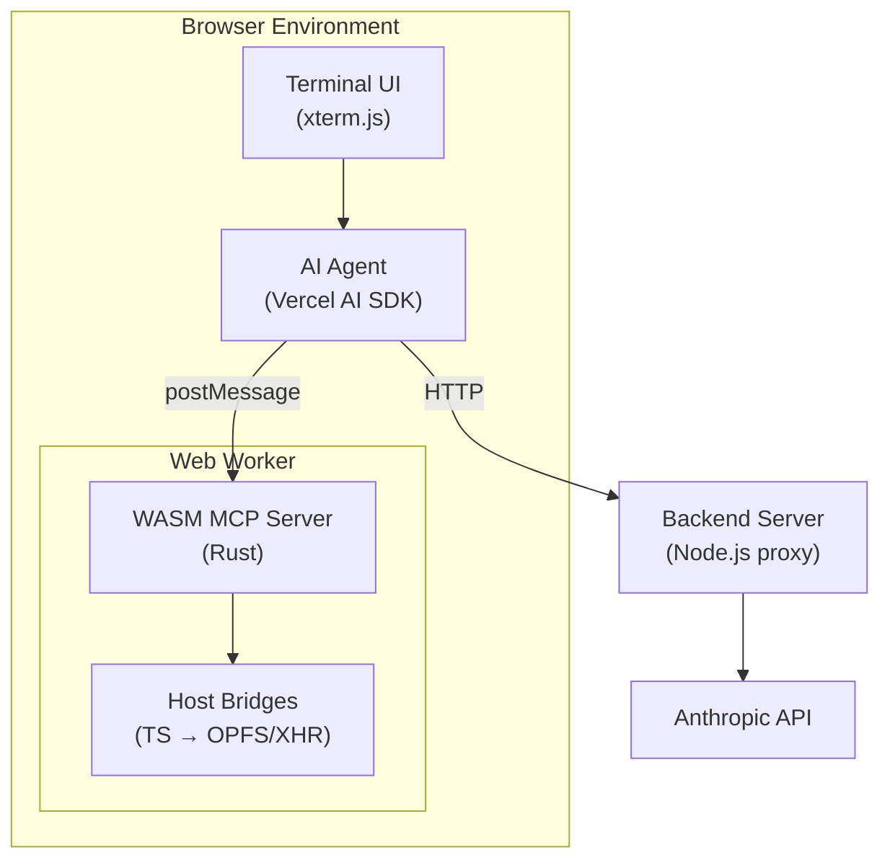

# Web Agent

Browser-native sandboxed development environment with MCP integration.

## Architecture



**Components:**

| Component | Technology | Purpose |
|-----------|------------|---------|
| [runtime/](runtime/README.md) | Rust + WASI P2 | WASM MCP server with TypeScript execution |
| [frontend/](frontend/src/README.md) | TypeScript + Vite | Terminal UI with AI agent orchestration |
| [frontend/src/wasm/](frontend/src/wasm/README.md) | TypeScript | Host bridges connecting WASM to browser APIs |
| backend/ | Node.js | API proxy for Anthropic |

## Quick Start

### Prerequisites

- Rust 1.83+ with `wasm32-wasip2` target
- Node.js 20+
- Docker (optional)

```bash
# Install Rust tooling
rustup target add wasm32-wasip2
cargo install cargo-component wit-deps cargo-watch

# Install dependencies
npm install

# Build everything
npm run build

# Development with hot reload
npm run dev
```

This starts:

- WASM component rebuild on Rust changes (via `cargo watch`)
- Frontend dev server on <http://localhost:5173>

## Build Commands

| Command | Description |
|---------|-------------|
| `npm run build` | Build WASM component + frontend |
| `npm run build:wasm` | Build WASM component only |
| `npm run build:frontend` | Build frontend only |
| `npm run dev` | Hot reload for WASM + frontend |
| `npm run dev:wasm` | Watch Rust changes only |
| `npm run dev:frontend` | Frontend dev server only |
| `npm run clean` | Clean all build artifacts |
| `npm test` | Run Rust tests |

### Frontend-specific Commands

```bash
cd frontend

# Transpile WASM component to ES modules
npm run transpile:component

# Clean generated WASM bindings
npm run clean:wasm
```

## Project Structure

```text
web-agent/
├── Cargo.toml               # Rust workspace root
├── package.json             # npm scripts orchestration
│
├── runtime/                 # ← Rust WASM MCP server
│   ├── README.md            # Detailed architecture docs
│   ├── Cargo.toml
│   ├── src/
│   │   ├── main.rs          # HTTP handler + MCP dispatch
│   │   ├── mcp_server.rs    # JSON-RPC types
│   │   └── ...
│   └── wit/                 # WASI interface definitions
│       ├── world.wit        # Component world (pure WASI interfaces)
│       └── deps/            # WASI dependencies
│
├── frontend/                # ← Browser UI + agent
│   ├── package.json
│   ├── src/
│   │   ├── main.tsx         # React entry point
│   │   ├── README.md        # Frontend architecture docs
│   │   └── wasm/            # ← Host bridges + generated code
│   │       ├── README.md    # Bridge layer docs
│   │       ├── mcp-server/  # jco-transpiled WASM (generated)
│   │       ├── opfs-filesystem-impl.ts
│   │       └── wasi-http-impl.ts
│   └── vite.config.ts
│
└── backend/                 # API proxy server
    └── src/index.ts
```

## MCP Tools

The WASM runtime provides these tools to the AI agent:

| Tool | Description |
|------|-------------|
| `shell_eval` | Evaluate shell commands (tsx, ls, cat, curl, etc.) |
| `read_file` | Read file from virtual filesystem (OPFS) |
| `write_file` | Write file to virtual filesystem |
| `list` | List directory contents |
| `grep` | Search for patterns in files |
| `edit_file` | Find and replace text in files |

Shell commands include a full busybox-style suite: `tsx`, `tsc`, `ls`, `cat`, `grep`, `sed`, `find`, `curl`, `jq`, `xargs`, `diff`, and more.

## Docker

### Development

```bash
docker-compose up
```

Features:

- Hot reload for all services
- `cargo watch` for WASM rebuilds
- Volume mounts for live code changes

### Production

```bash
docker-compose -f docker-compose.prod.yml up

# Or build standalone
docker build -t web-agent .
docker run -p 8080:8080 web-agent
```

Multi-stage build: rust-builder → frontend-builder → backend-builder → production

## Environment Variables

### backend/.env

```bash
PORT=3000
ANTHROPIC_API_KEY=your_key_here
NODE_ENV=development
```

### frontend/.env

```bash
VITE_API_URL=http://localhost:3000
```

## Testing

```bash
# All Rust tests
cargo test --workspace

# Specific package
cargo test -p ts-runtime-mcp

# Validate WASM component
wasm-tools component wit runtime/target/wasm32-wasip2/release/ts-runtime-mcp.wasm
```

## Troubleshooting

### Rust build fails

```bash
rustup update
rustup target add wasm32-wasip2
cargo install cargo-component wit-deps --locked
```

### jco transpile fails

```bash
npm install -g @bytecodealliance/jco@latest
```

### Docker build is slow

Use BuildKit:

```bash
DOCKER_BUILDKIT=1 docker build -t web-agent .
```

## License

MIT
