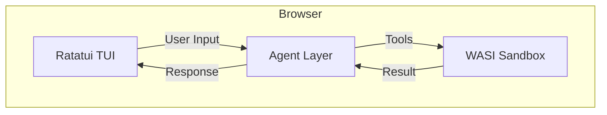
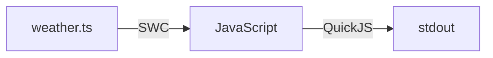

# Edge Agent

*✨ Vibed with [Antigravity](https://antigravity.google) ✨*

**[→ Try it now](https://agent.edge-agent.dev)** | [Docs](https://edge-agent.dev/docs.html)

---

## The Story

I was nerd-sniped into: *Why can't an agent in the browser just write dynamic code and execute it?*

Everything else is either:

* **Fully in the Cloud**: A web UI calling a VM. High latency, privacy concerns, and it's not really *yours*.
* **Locally Installed**: Tedious setup, complex dependencies, and risk to your local machine.

**Edge Agent is different.** It's primed out of the box. If you can visit the page, you can get the value.
It runs a full WASM-based runtime that compiles and executes TypeScript natively in your browser tab. Safe, private, and instant. No server round-trips. No external sandbox.

---

## FAQ

### What actually is this?

It's a full-stack agent environment running in WebAssembly, consisting of three parts:

1. **Ratatui TUI**: A terminal interface written in Rust, compiled to WASM. It supports full keyboard navigation, mouse events, and resizing.
2. **Agent Layer**: A multi-turn agent driven by [Rig](https://github.com/0xPlaygrounds/rig), supporting Anthropic, OpenAI, and Gemini.
3. **Browser Sandbox**: A WASI Preview 2 runtime that provides a virtual file system (OPFS), shell ecosystem, and code execution.



### How does it run code?

That's the "nerd-sniped" part. We built a pipeline entirely in WASM:



When the agent (or you) runs `tsx script.ts`, the runtime transpiles it on the fly using SWC and executes it in an embedded QuickJS engine.

### What can the shell do?

It's not a toy shell. It supports:

* **Core utils**: `ls`, `cd`, `cat`, `grep`, `cp`, `mv`, `rm`
* **Development**: `tsx` (TypeScript), `git` (via isomorphic-git), `sqlite3`
* **Interactive features**: Tab completion, history (persisted to OPFS), reverse search (`Ctrl+R`)

### Can I connect to external tools?

Yes. While the agent runs in the browser, it can connect to local or remote [MCP (Model Context Protocol)](https://modelcontextprotocol.io/) servers.

We also provide an **MCP Bridge** that lets *external* agents (like Claude Code) use the browser sandbox as their backend:

```bash
cd tools/mcp-bridge && npm start
# Then run Claude Code:
claude --tools "" --mcp-config '{"mcpServers": {"browser-sandbox": {"type": "http", "url": "http://localhost:3050/mcp"}}}'
```

This effectively turns your browser tab into a secure, local sandbox for any AI agent.

### Can I embed this in my app?

Yes. The core logic is structured as a package, `@tjfontaine/web-agent-core`, though currently you must build from source.

```typescript
import { WebAgent } from '@tjfontaine/web-agent-core';

// 1. Initialize
const agent = new WebAgent({
  provider: 'anthropic',
  model: 'claude-3-5-sonnet-20241022',
  apiKey: 'sk-...'
});
await agent.initialize();

// 2. Chat with tools
for await (const event of agent.send('Write a script to fetch weather')) {
  if (event.type === 'chunk') console.log(event.text);
  if (event.type === 'tool-call') console.log('Executing:', event.toolName);
}
```

### How does it handle async operations in WASM?

We support two modes depending on browser capabilities:

* **JSPI (JavaScript Promise Integration)**: Used in Chrome/Edge. Allows WASM to suspend execution while waiting for async browser APIs (like `fetch` or `OPFS`).
* **Asyncify / Sync Shim**: Used in Safari/Firefox. Uses a synchronous worker bridge to handle I/O without native stack switching.

---

### Development

```bash
# Install dependencies
npm install

# Build WASM and packages
npm run build

# Start dev server
npm run dev
```

### License

MIT
