# Agent in a Browser

*✨ Lovingly vibed with [Antigravity](https://antigravity.google) ✨*

**🚀 Try it now: [agent.edge-agent.dev](https://agent.edge-agent.dev)** — hosted on Cloudflare Workers (static assets only, no backend processing)

A fully browser-native AI coding assistant. No server required for execution—just your API key and a browser.

## What This Is & Why It Exists

**Agent in a Browser** is an autonomous AI agent that runs entirely in your browser. It provides a terminal-based interface where you can converse with AI models (Anthropic Claude, OpenAI GPT, or any OpenAI-compatible endpoint) and give them real tools to work with: a file system, shell commands, TypeScript execution, HTTP requests, and more.

### The Problem

Most AI coding assistants require either:

- **Cloud-hosted sandboxes** (privacy concerns, latency, cost)
- **Local installation** (friction, system dependencies, platform limitations)
- **Proprietary runtimes** (vendor lock-in, closed-source execution environments)

### The Solution

Web Agent takes a different approach:

| Requirement | How Web Agent Solves It |
|-------------|------------------------|
| **Zero installation** | Opens in any modern browser |
| **Full privacy** | API keys stay in your browser (memory-only, never persisted) |
| **Real tools** | WASM sandbox with shell, file system, TypeScript, HTTP |
| **Bring your own key** | Direct API calls to Anthropic/OpenAI—no proxy required |
| **100% open source** | No proprietary sandboxes or execution environments |
| **Works offline** | Once loaded, the sandbox runs without network (except LLM calls) |

### What You Can Do

- Ask the AI to write code, and it can actually **run** it in the sandbox
- Persist files across sessions using the browser's [Origin Private File System (OPFS)](https://developer.mozilla.org/en-US/docs/Web/API/File_System_API/Origin_private_file_system)
- Use 50+ Unix-like shell commands: `ls`, `cat`, `grep`, `sed`, `find`, `curl`, `jq`, `diff`, `sort`, `wc`, and more
- Execute TypeScript/JavaScript with ESM imports (auto-resolved from [esm.sh](https://esm.sh) CDN)
- Make HTTP requests from within scripts (`fetch()` available)
- Use git commands: `git init`, `git add`, `git commit`, `git status`, `git log`, `git diff`
- Run SQLite databases with `sqlite3`
- Queue messages while the agent is working, with real-time "steering" support

### Terminal Interface Features

| Feature | Description |
|---------|-------------|
| **Ratatui TUI** | 100% Rust-driven terminal UI via ghostty-web |
| **Multi-provider support** | Anthropic, OpenAI, and any OpenAI-compatible endpoint |
| **Bring your own API key** | Keys stored in browser memory only (never persisted) |
| **Persistent history** | Command history saved across sessions |
| **Real-time steering** | Send messages while the agent is working to adjust its approach |

### Key Design Principles

1. **Browser-First**: All execution happens in a WASM sandbox running in a Web Worker. No server-side code execution.
2. **OSS-Only Stack**: Rust + WASI P2 for the sandbox, Ratatui for TUI, QuickJS for JS execution, SWC for TypeScript transpilation.
3. **MCP Native**: Tools are exposed via [Model Context Protocol](https://spec.modelcontextprotocol.io/), making the architecture extensible and standardized.
4. **Security by Isolation**: The sandbox cannot access your real file system or make unauthorized network requests.
5. **Multi-Provider**: Designed for "bring your own key"—works with Anthropic, OpenAI, or any OpenAI-compatible API.

### Why WASI Preview 2?

We chose [WASI Preview 2](https://github.com/WebAssembly/WASI/blob/main/preview2/README.md) (the Component Model) over WASI Preview 1 or raw WASM for several reasons:

| Aspect | WASI P1 | WASI P2 (Component Model) |
|--------|---------|---------------------------|
| **Interface Design** | POSIX-like, monolithic | Modular, composable interfaces |
| **HTTP Support** | Not standardized | `wasi:http` with typed requests/responses |
| **Async I/O** | `poll_oneoff` (limited) | First-class `Pollable` resources |
| **Type Safety** | C-style ABI | WIT-defined strongly-typed interfaces |
| **Future-Proofing** | Legacy, frozen | Active development, ecosystem growth |

**Specific benefits for this project:**

- **`wasi:http/incoming-handler`**: The WASM component exports an HTTP handler, making it trivially callable via POST requests from JavaScript. No custom FFI needed.
- **`wasi:filesystem`**: Standard file operations that we bridge to OPFS via TypeScript shims. The interface is well-defined and testable.
- **Component composition**: We can potentially add more WASM components (e.g., image processing, crypto) without changing the host integration.
- **`jco transpile`**: The [jco](https://github.com/bytecodealliance/jco) toolchain transpiles WASI P2 components to ES modules with automatic host bindings.

The tradeoff is complexity: WASI P2 requires custom JavaScript shims for browser APIs (OPFS, sync XHR) since there's no native browser WASI runtime yet. We implemented these in `frontend/src/wasm/`, including:

- **Lazy OPFS loading**: Directory contents are scanned on-demand using a helper worker and `SharedArrayBuffer` + `Atomics.wait()` for true synchronous blocking. Only the root directory is scanned at startup.
- **Transport routing**: HTTP requests from the TUI are routed through the sandbox worker to the MCP server.
- **Custom Pollables**: Clock and I/O pollables with busy-wait implementations for the browser environment.

### Browser Compatibility & Async Modes

We use a dual-build approach to provide cross-browser support for async module loading:

| Browser | Async Mode | Module Loading Strategy |
|---------|------------|-------------------------|
| **Chrome** | JSPI (JavaScript Promise Integration) | Lazy loading with WebAssembly stack switching |
| **Safari** | Sync | Eager loading at startup |
| **Firefox** | Sync | Eager loading at startup |

**How it works:**

- **JSPI mode** (Chrome): Uses experimental `WebAssembly.Suspending` and `WebAssembly.promising` APIs. Modules load on-demand when first used, with the WASM call stack suspended until loading completes.
- **Sync mode** (Safari/Firefox): All lazy modules are pre-loaded during initialization. No async suspension needed.

The runtime detects JSPI support via `typeof WebAssembly?.Suspending !== 'undefined'` and loads the appropriate MCP server variant (`mcp-server-jspi/` or `mcp-server-sync/`).

---

## Architecture

```mermaid
graph TB
    subgraph Browser["Browser Environment"]
        Terminal["ghostty-web\n(WebGL Terminal)"]
        
        subgraph MainThread["Main Thread"]
            TuiLoader["tui-loader.ts"]
            RatatuiWasm["web-agent-tui.wasm\n(Ratatui TUI)"]
        end
        
        subgraph Worker["Web Worker"]
            WASM["ts-runtime-mcp.wasm\n(MCP Server)"]
            Bridges["Host Bridges\n(TS → OPFS)"]
        end
    end
    
    LLM["LLM API\n(Anthropic/OpenAI)"]
    
    Terminal --> TuiLoader
    TuiLoader --> RatatuiWasm
    RatatuiWasm -->|"shell:unix/command"| WASM
    WASM --> Bridges
    RatatuiWasm -->|"HTTP"| LLM
```



**Components:**

| Component | Technology | Purpose |
|-----------|------------|---------|
| [runtime/](runtime/README.md) | Rust + WASI P2 | WASM MCP server with TypeScript execution |
| [frontend/](frontend/src/README.md) | TypeScript + Vite | Terminal host + WASM bridge layer |
| [frontend/src/wasm/](frontend/src/wasm/README.md) | TypeScript | Host bridges connecting WASM to browser APIs |

## Quick Start

### Prerequisites

- Rust 1.83+ with `wasm32-wasip2` target
- Node.js 20+
- Docker (optional)

```bash
# Install Rust tooling
rustup target add wasm32-wasip2
cargo install cargo-component wit-deps-cli cargo-watch

# Install dependencies
npm install

# Build everything
npm run build

# Development with hot reload
npm run dev
```

This starts:

- WASM component rebuild on Rust changes (via `cargo watch`)
- Frontend dev server on <http://localhost:3000>

## Build Commands

| Command | Description |
|---------|-------------|
| `npm run build` | Build WASM component + frontend |
| `npm run build:wasm` | Build WASM component only |
| `npm run build:frontend` | Build frontend only |
| `npm run dev` | Hot reload for WASM + frontend |
| `npm run dev:wasm` | Watch Rust changes only |
| `npm run dev:frontend` | Frontend dev server only |
| `npm run clean` | Clean all build artifacts |
| `npm test` | Run Rust tests |

### Frontend-specific Commands

```bash
cd frontend

# Transpile all WASM components to ES modules
npm run transpile:all

# Transpile individual components (if needed)
npm run transpile:component      # Main MCP server (both JSPI and sync)
npm run transpile:tsx-engine     # TypeScript execution module
npm run transpile:sqlite-module  # SQLite database module
npm run transpile:web-agent-tui  # Ratatui TUI

# Clean generated WASM bindings
npm run clean:wasm
```

### Modular WASM Architecture

Heavy modules are lazy-loaded on first use to reduce initial load time:

| Module | Commands | Loaded When |
|--------|----------|-------------|
| `mcp-server-jspi/` | Most shell commands (Chrome) | Startup |
| `mcp-server-sync/` | Most shell commands (Safari/Firefox) | Startup |
| `tsx-engine/` | `tsx`, `tsc` | First TypeScript execution* |
| `sqlite-module/` | `sqlite3` | First database operation* |
| `edtui-module/` | `vim`, `vi`, `edit` | First editor invocation* |
| `ratatui-demo/` | `counter`, `tui-demo`, `ansi-demo` | First demo invocation* |
| `web-agent-tui/` | TUI application | Startup |

*In Sync mode, these are pre-loaded at startup for browsers without JSPI support.

## Project Structure

```text
web-agent/
├── Cargo.toml               # Rust workspace root
├── package.json             # npm scripts orchestration
│
├── runtime/                 # ← Rust WASM MCP server
│   ├── README.md            # Detailed architecture docs
│   ├── Cargo.toml
│   ├── src/
│   │   ├── main.rs          # HTTP handler + MCP dispatch
│   │   ├── mcp_server.rs    # JSON-RPC types
│   │   └── shell/           # Shell command implementation
│   ├── wit/                 # WASI interface definitions
│   │   ├── world.wit        # Component world (pure WASI)
│   │   └── deps/            # WASI dependencies
│   └── crates/              # ← Modular WASM components
│       ├── tsx-engine/      # TypeScript/TSX execution (lazy-loaded)
│       ├── sqlite-module/   # SQLite database (lazy-loaded)
│       ├── edtui-module/    # Vim-style editor (lazy-loaded)
│       ├── ratatui-demo/    # TUI demo commands (lazy-loaded)
│       └── web-agent-tui/   # Ratatui TUI application
│
├── frontend/                # ← Browser UI + agent
│   ├── package.json
│   ├── src/
│   │   ├── main-tui.ts      # Entry point
│   │   ├── README.md        # Frontend architecture docs
│   │   ├── agent/
│   │   │   └── sandbox.ts   # Sandbox worker management
│   │   ├── mcp/
│   │   │   ├── Client.ts    # MCP type definitions
│   │   │   └── WasmBridge.ts # WASM MCP bridge
│   │   ├── workers/
│   │   │   └── SandboxWorker.ts
│   │   └── wasm/            # ← Host bridges + generated code
│   │       ├── README.md    # Bridge layer docs
│   │       ├── tui-loader.ts  # ghostty + Ratatui integration
│   │       ├── async-mode.ts  # JSPI detection & dynamic loading
│   │       ├── mcp-server-jspi/ # JSPI mode (Chrome)
│   │       ├── mcp-server-sync/ # Sync mode (Safari/Firefox)
│   │       ├── tsx-engine/  # jco-transpiled TSX module (generated)
│   │       ├── sqlite-module/ # jco-transpiled SQLite (generated)
│   │       ├── web-agent-tui/ # jco-transpiled TUI (generated)
│   │       ├── lazy-modules.ts # On-demand module loading
│   │       ├── opfs-filesystem-impl.ts
│   │       └── wasi-http-impl.ts
│   └── vite.config.ts
│
├── packages/                # ← Standalone npm packages
│   ├── wasm-loader/         # Core module registration system
│   ├── wasm-modules/        # Aggregator for all module metadata
│   ├── wasm-tsx/            # TSX engine metadata
│   ├── wasm-sqlite/         # SQLite module metadata
│   ├── wasm-ratatui/        # Ratatui demo metadata
│   ├── wasm-vim/            # Vim editor metadata
│   ├── wasi-shims/          # Shared WASI shims
│   ├── opfs-wasi-fs/        # OPFS filesystem implementation
│   ├── wasi-http-handler/   # HTTP handler implementation
│   ├── mcp-wasm-server/     # MCP runtime with lazy loading
│   └── browser-mcp-runtime/ # Meta-package for easy setup
│
└── worker/                  # Cloudflare worker (static serving)
    └── index.js
```

### Standalone Packages

The `packages/` directory contains npm packages designed for independent consumption:

| Package | Purpose |
|---------|---------|
| `@tjfontaine/wasm-loader` | Core module registration system for lazy-loaded WASM commands |
| `@tjfontaine/wasm-modules` | Aggregator that re-exports all module metadata |
| `@tjfontaine/wasm-tsx` | TSX/TypeScript engine metadata (`tsx`, `tsc`) |
| `@tjfontaine/wasm-sqlite` | SQLite module metadata (`sqlite3`) |
| `@tjfontaine/wasm-ratatui` | Ratatui TUI demo metadata (`counter`, `tui-demo`) |
| `@tjfontaine/wasm-vim` | Vim editor metadata (`vim`, `vi`, `edit`) |
| `@tjfontaine/wasi-shims` | Shared WASI shims (clocks, streams, terminal) |
| `@tjfontaine/opfs-wasi-fs` | OPFS-backed WASI filesystem |
| `@tjfontaine/wasi-http-handler` | Fetch-based WASI HTTP handler |
| `@tjfontaine/mcp-wasm-server` | MCP runtime with JSPI detection |
| `@tjfontaine/browser-mcp-runtime` | Meta-package for one-line setup |

> **Design Pattern**: The `wasm-*` packages export only metadata (command names + modes). The consuming application provides the loader function to avoid Rollup bundling issues with dynamic WASM imports.

## MCP Tools

The WASM runtime provides these tools to the AI agent:

| Tool | Description |
|------|-------------|
| `shell_eval` | Evaluate shell commands (tsx, ls, cat, curl, etc.) |
| `read_file` | Read file from virtual filesystem (OPFS) |
| `write_file` | Write file to virtual filesystem |
| `list` | List directory contents |
| `grep` | Search for patterns in files |
| `edit_file` | Find and replace text in files |
| `task_write` | Write task list for user visibility |

Shell commands include a full busybox-style suite: `tsx`, `tsc`, `ls`, `cat`, `grep`, `sed`, `find`, `curl`, `jq`, `xargs`, `diff`, `git`, `sqlite3`, and more.

## Docker

### Development

```bash
docker-compose up
```

Features:

- Hot reload for all services
- `cargo watch` for WASM rebuilds
- Volume mounts for live code changes

### Production

```bash
docker-compose -f docker-compose.prod.yml up

# Or build standalone
docker build -t web-agent .
docker run -p 8080:8080 web-agent
```

Multi-stage build: rust-builder → frontend-builder → production

## Testing

```bash
# All Rust tests
cargo test --workspace

# Specific package
cargo test -p ts-runtime-mcp

# Frontend unit tests
cd frontend && npm test

# Frontend E2E tests (Playwright)
cd frontend && npm run test:e2e

# Validate WASM component
wasm-tools component wit target/wasm32-wasip2/release/ts-runtime-mcp.wasm
```

## Troubleshooting

### Rust build fails

```bash
rustup update
rustup target add wasm32-wasip2
cargo install cargo-component wit-deps-cli --locked
```

### jco transpile fails

```bash
npm install -g @bytecodealliance/jco@latest
```

### Docker build is slow

Use BuildKit:

```bash
DOCKER_BUILDKIT=1 docker build -t web-agent .
```

## License

MIT
